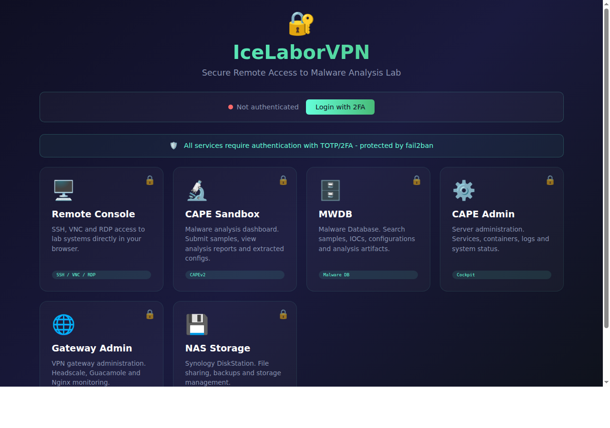
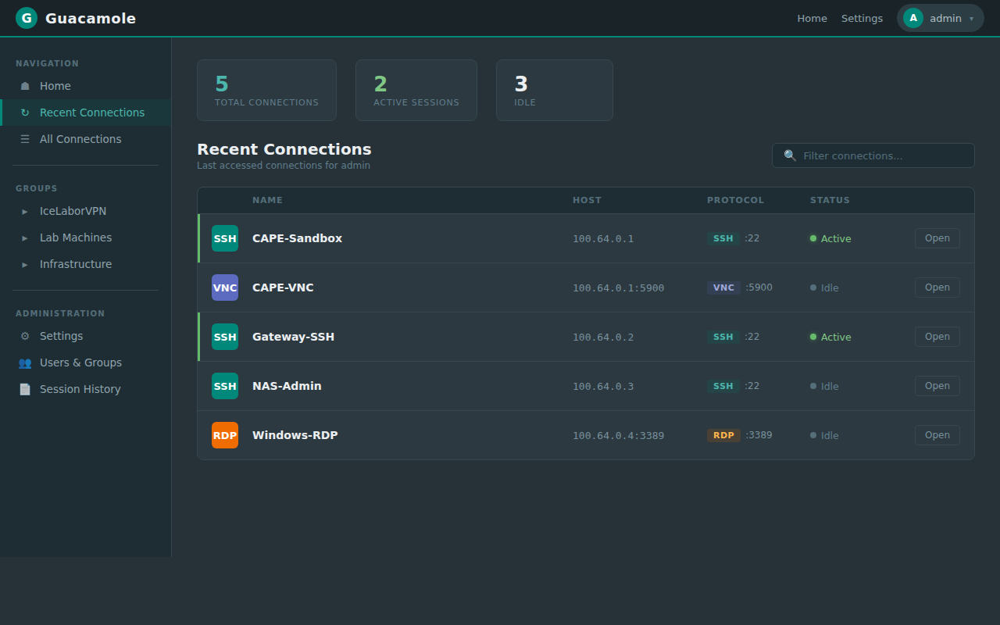
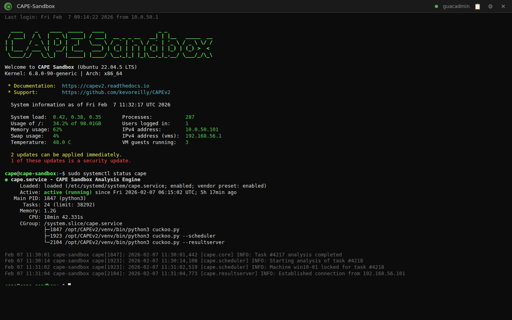
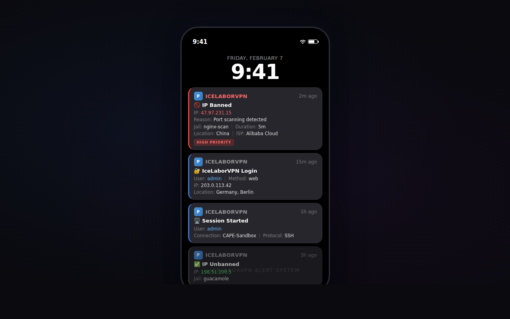

# IceLaborVPN

**Secure Zero-Trust Remote Access Gateway for Malware Analysis Labs**

[](LICENSE)
[](docs/OPERATIONS-MANUAL.md#4-dora-compliance)
[](docs/OPERATIONS-MANUAL.md#5-mitre-attck-mapping)

---

## Overview

IceLaborVPN provides secure, browser-based remote access to isolated malware analysis infrastructure without requiring client software installation. Designed for regulated environments (DORA, ISO 27001), it implements defense-in-depth security with comprehensive audit logging.



### Key Features

- **Zero-Trust Architecture** - WireGuard VPN mesh with Headscale control plane
- **HTML5 Remote Access** - SSH, VNC, RDP via browser (Apache Guacamole)
- **Multi-Factor Authentication** - TOTP/2FA mandatory for all users
- **Session Recording** - Full audit trail for compliance
- **Brute-Force Protection** - Multi-layer defense (Guacamole, nginx, Fail2ban)
- **Real-time Alerts** - Pushover notifications for security events
- **DORA/MITRE Compliant** - Comprehensive documentation for regulators

---

## Screenshots

### Login Portal

*Secure login with TOTP/2FA authentication*

### Dashboard

*Connection overview with quick access to lab systems*

### SSH Session

*HTML5 SSH terminal with session recording*

### Security Alerts

*Real-time security notifications via Pushover*

---

## Architecture

```
┌─────────────────────────────────────────────────────────────────┐
│                     INTERNET                                     │
└───────────────────────────┬─────────────────────────────────────┘
                            │ HTTPS (TLS 1.3)
                            ▼
┌─────────────────────────────────────────────────────────────────┐
│  IceLaborVPN Gateway                                             │
│  ┌─────────────┐  ┌─────────────┐  ┌─────────────┐              │
│  │   Nginx     │  │  Guacamole  │  │  Fail2ban   │              │
│  │ Rate Limit  │─▶│    TOTP     │  │    IPS      │              │
│  └─────────────┘  │  Recording  │  └─────────────┘              │
│                   └──────┬──────┘                                │
│  ┌─────────────┐         │                                       │
│  │  Headscale  │◀────────┘                                       │
│  │  VPN Ctrl   │                                                 │
│  └──────┬──────┘                                                 │
└─────────┼───────────────────────────────────────────────────────┘
          │ WireGuard VPN
          ▼
┌─────────────────────────────────────────────────────────────────┐
│  Lab Network (Tailscale Mesh)                                    │
│  ┌───────────┐  ┌───────────┐  ┌───────────┐  ┌───────────┐    │
│  │   CAPE    │  │   MWDB    │  │  Cockpit  │  │ Analysis  │    │
│  │  Sandbox  │  │  Database │  │  WebUI    │  │    VMs    │    │
│  │<TAILSCALE_IP> │  │<TAILSCALE_IP> │  │<TAILSCALE_IP> │  │<TAILSCALE_IP> │    │
│  │   :8443   │  │   :8443   │  │   :9090   │  │           │    │
│  └───────────┘  └───────────┘  └───────────┘  └───────────┘    │
└─────────────────────────────────────────────────────────────────┘
```

---

## Quick Start

### Prerequisites

- Ubuntu 22.04 LTS or Debian 12
- Public IPv4 address
- DNS A record pointing to your server
- Pushover account (for notifications)

### Installation

```bash
# Clone repository
git clone https://github.com/icepaule/IceLaborVPN.git
cd IceLaborVPN

# Configure environment
cp .env.example .env
nano .env  # Fill in all values!

# Run installer
chmod +x scripts/install.sh
sudo ./scripts/install.sh
```

### First Login

1. Navigate to `https://your-domain.com/guacamole/`
2. Login with configured admin credentials
3. Scan QR code with authenticator app (Google/Microsoft Authenticator)
4. Enter 6-digit TOTP code
5. Access your lab systems!

---

## Configuration

### Environment Variables

| Variable | Description | Required |
|----------|-------------|----------|
| `HEADSCALE_DOMAIN` | Your public domain | Yes |
| `GUAC_ADMIN_PASSWORD` | Admin password (min. 12 chars) | Yes |
| `GUAC_DB_PASSWORD` | Database password | Yes |
| `PUSHOVER_APP_TOKEN` | Pushover application token | Yes |
| `PUSHOVER_USER_KEY` | Pushover user key | Yes |
| `SSL_EMAIL` | Email for Let's Encrypt | Yes |

See [.env.example](.env.example) for all options.

### Adding Connections

Edit `/opt/guacamole/db-init/02-admin-user.sql` or use the Guacamole web interface:

1. Login as admin
2. Settings → Connections → New Connection
3. Configure SSH/VNC/RDP parameters
4. Assign to users/groups

### Adding Tailscale Nodes

```bash
# On the gateway
/opt/IceLaborVPN/scripts/headscale-onboard.sh --generate-key

# On the new node
sudo tailscale up --login-server https://your-domain.com \
    --authkey <generated-key>
```

---

## Security Features

### Authentication Stack

| Layer | Protection |
|-------|------------|
| TLS 1.3 | Transport encryption |
| nginx Rate Limiting | 5 logins/min, 30 req/sec |
| Guacamole Brute-Force | 5 attempts → 5 min ban |
| Fail2ban | 5 attempts → 1 hour firewall ban |
| TOTP/2FA | Mandatory second factor |
| Session Timeout | 60 minutes inactivity |

### Monitoring & Alerting

Real-time Pushover notifications for:
- ✅ Successful logins
- ✅ Session starts (SSH/VNC/RDP)
- 🚫 IP bans (Fail2ban)
- ⚠️ Attack detection (SQLi, XSS, scanners)
- 🔴 Service failures

### Compliance

- **DORA** - Full mapping in operations manual
- **MITRE ATT&CK** - Detection rules and mitigations
- **ISO 27001** - Access control documentation
- **Audit Trail** - 5-year session recording retention

---

## Documentation

| Document | Description |
|----------|-------------|
| [Operations Manual](docs/OPERATIONS-MANUAL.md) | Complete ITSO handbook (DORA/MITRE) |
| [Installation Guide](docs/INSTALLATION.md) | Step-by-step setup |
| [User Guide](docs/USER-GUIDE.md) | End-user documentation |
| [Troubleshooting](docs/TROUBLESHOOTING.md) | Common issues and solutions |

---

## Directory Structure

```
IceLaborVPN/
├── .env.example           # Environment template
├── README.md              # This file
├── LICENSE                # MIT License
├── scripts/
│   ├── install.sh         # Main installer
│   ├── backup.sh          # Backup script
│   ├── pushover-notify.sh # Notification script
│   ├── guacamole-monitor.sh # Session monitor
│   └── headscale-onboard.sh # Node onboarding
├── config/
│   ├── headscale.yaml.template
│   ├── fail2ban-*.conf
│   └── nginx templates
├── guacamole/
│   ├── docker-compose.yml
│   └── SQL templates
├── nginx/
│   └── headscale.conf.template
├── systemd/
│   └── service files
└── docs/
    ├── OPERATIONS-MANUAL.md
    ├── screenshots/
    └── ...
```

---

## Troubleshooting

### Common Issues

**Login fails with "Invalid credentials"**
```bash
# Check Guacamole logs
docker logs guacamole | grep -i auth
```

**TOTP code rejected**
- Verify system time is synchronized (`timedatectl`)
- Regenerate TOTP in user settings

**Connection timeout**
```bash
# Check Tailscale connectivity
tailscale ping <TAILSCALE_IP>
```

**Fail2ban blocking legitimate users**
```bash
# Unban IP
sudo fail2ban-client set guacamole unbanip 192.0.2.1
```

---

## Contributing

Contributions welcome! Please read our [Contributing Guide](CONTRIBUTING.md).

---

## License

MIT License - see [LICENSE](LICENSE)

---

## Author

**IcePorge Project**
- GitHub: [@icepaule](https://github.com/icepaule)
- Email: info@mpauli.de

---

## Acknowledgments

- [Apache Guacamole](https://guacamole.apache.org/)
- [Headscale](https://github.com/juanfont/headscale)
- [Tailscale](https://tailscale.com/)
- [MITRE ATT&CK](https://attack.mitre.org/)
